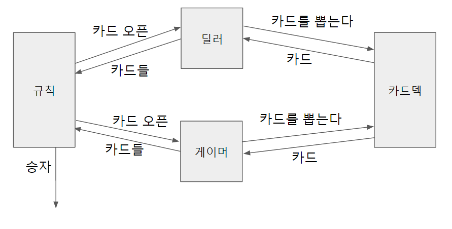
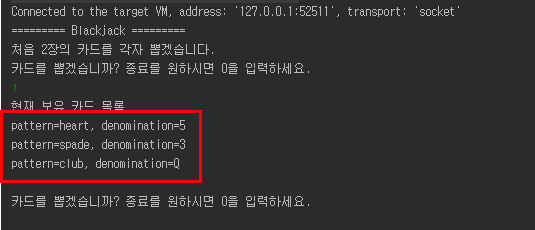
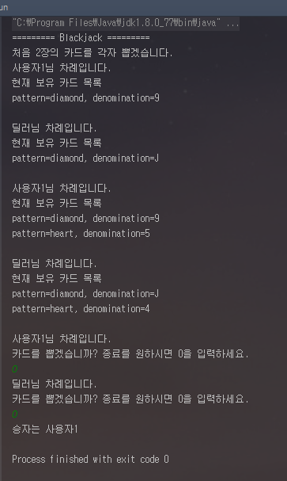
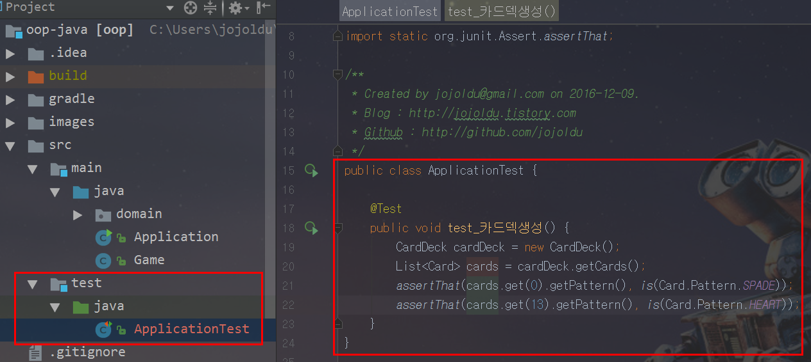
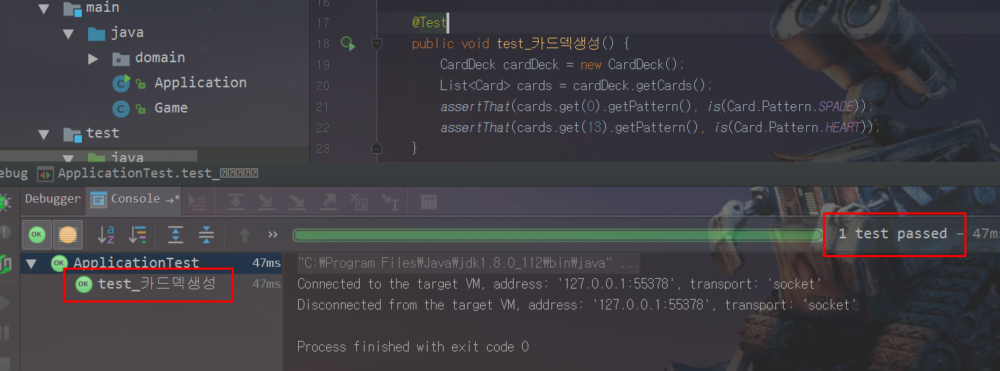
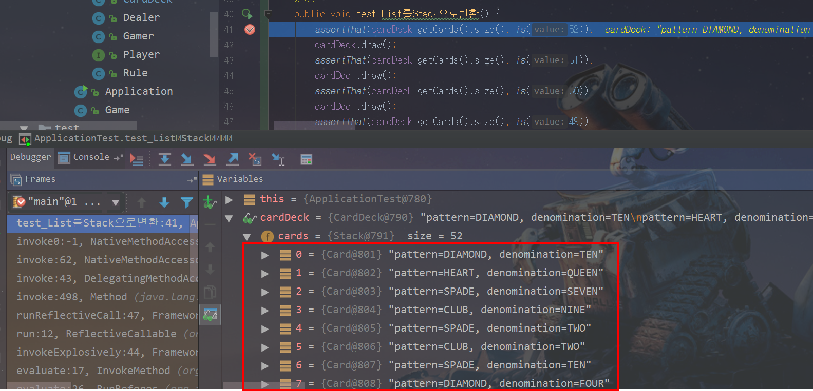
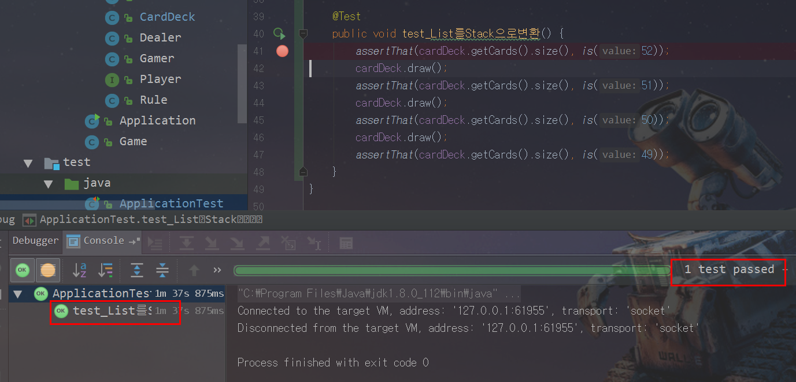

# 순수 Java로 이루어진 프로젝트
> 객체지향을 이해하는데 있어 게시판은 좋은 예제가 아니라는 자바지기(박재성)님과 OKKY fender님의 이야기로 시작한 프로젝트

Java로 웹을 한다고 하면서 실제로 Java와 객체지향을 공부한적이 없던것 같다는 생각이 있었습니다. <br/>


그래서 데이터베이스, JSP를 전혀 사용하지 않고 Java와 객체에 좀 더 집중할 예정입니다. <br/>
모든 코드는 [Github](https://github.com/jojoldu/oop-java)에 있으니 전체 코드를 보고싶으시면 참고하시면 될것 같습니다. <br/>
(공부한 내용을 정리하는 [Github](https://github.com/jojoldu/blog-code)와 세미나&책 후기를 정리하는 [Github](https://github.com/jojoldu/review) 를 star 하시면 실시간으로 feed를 받을 수 있습니다.)

### 주제
블랙잭 게임([나무위키](https://namu.wiki/w/%EB%B8%94%EB%9E%99%EC%9E%AD(%EC%B9%B4%EB%93%9C%EA%B2%8C%EC%9E%84)) 참고)을 개량해서 구현할 예정입니다. <br/>
블랙잭 규칙 전부를 구현하는건 지나친 감이 있어서 조금은 스펙아웃하였습니다. <br/>
화면 구성은 모두 콘솔로 진행할 예정입니다..

### 블랙잭 규칙
* 딜러와 게이머 단 2명만 존재한다.
* 카드는 조커를 제외한 52장이다. (즉, 카드는 다이아몬드,하트,스페이드,클럽 무늬를 가진 A,2~10,K,Q,J 으로 이루어져있다.)
* 2~10은 숫자 그대로 점수를, K/Q/J는 10점으로, **A는 1로** 계산한다. (기존 규칙은 A는 1과 11 둘다 가능하지만 여기선 1만 허용하도록 스펙아웃)
* 딜러와 게이머는 순차적으로 카드를 하나씩 뽑아 각자 2개의 카드를 소지한다.
* 게이머는 얼마든지 카드를 추가로 뽑을 수 있다.
* 딜러는 2카드의 합계 점수가 16점 이하이면 반드시 1장을 추가로 뽑고, 17점 이상이면 추가할 수 없다.
* 양쪽다 추가 뽑기 없이, 카드를 오픈하면 딜러와 게이머 중 소유한 카드의 합이 21에 가장 가까운 쪽이 승리한다.
* 단 21을 초과하면 초과한 쪽이 진다.

### 설계원칙

* 클래스 우선이 아닌, 객체의 속성과 행위가 우선이다.
  - 클래스는 객체를 추상화하는 도구일 뿐이다.

* 데이터가 아닌 메세지(행위)를 중심으로 객체를 설계해라.
  - 객체는 혼자 있을 수 없다. 다른 객체와의 **협력** 안에서만 존재할 수 있다.
  - 메세지를 중심으로, 해당 메세지가 어떤 객체를 필요로 하는지를 생각하자.

* 하나하나 지시하지 말고 요청해라.
  - 예를들어, 판사가 증인에게 1) 목격했던 장면을 떠올리고, 2) 떠오르는 시간을 순서대로 구성하고, 3) 말로 간결하게 표현해라 라고 요청하지 않는다. 그냥 "증언하라" 라고 요청한다.
  - 마찬가지로 객체의 설계단계에서도 책임이 있는 객체에 요청만 하도록 설계한다.

* 하나의 메소드는 하나의 일만 해야한다.

* 처음부터 완벽한 설계는 없다.
  - 설계를 코드로 구현해가는 과정에서 수정이 필요하다면 설계를 수정한다.

### 주요 객체
* 카드뭉치 (카드덱)
* 카드
* 규칙
* 딜러
* 게이머

### 주요 객체들의 속성과 역할
* 카드뭉치 (카드덱)
  - 52개의 서로 다른 카드를 갖고 있다.
  - 카드 1개를 뽑아준다.

* 카드
  - 다이아몬드, 하트, 스페이드, 클럽 중 1개의 무늬를 가지고 있다.
  - A,2~10,K,Q,J 중 하나를 가지고 있다.

* 규칙
  - 점수를 측정해준다.
  - 승패를 판단한다.

* 딜러
  - 추가로 카드를 받는다.
  - 단, 2카드의 합계 점수가 16점 이하이면 반드시 1장을 추가로 뽑고, 17점 이상이면 받을 수 없다.
  - 뽑은 카드를 소유한다.
  - 카드를 오픈한다.

* 게이머
  - 추가로 카드를 받는다.
  - 뽑은 카드를 소유한다.  
  - 카드를 오픈한다.

### 1. 추상화된 코드 구현
위의 "객체들의 속성과 역할"을 도식화 하면 아래와 같습니다. <br/>



위 관계도에 따라 간략하게 코드를 구현하면 아래와 같습니다. <br/>

**Card.java** <br/>
```
public class Card {
    private String pattern;
    private String denomination;

    public String getPattern() {
        return pattern;
    }

    public void setPattern(String pattern) {
        this.pattern = pattern;
    }

    public String getDenomination() {
        return denomination;
    }

    public void setDenomination(String denomination) {
        this.denomination = denomination;
    }
}

```
Card의 pattern은 무늬를, denomination는 끗수(A,2~10,J,Q,K)를 얘기합니다. <br/>
<br/>

**CardDeck.java** <br/>
```
public class CardDeck {
    private List<Card> cards;

    public Card getCard(){
        return null;
    }
}
```

**Dealer.java** <br/>
```
public class Dealer {
    private List<Card> cards;

    public void receiveCard(Card card) {}

    public List<Card> openCards(){
        return null;
    }
}
```

**Gamer.java** <br/>
```
public class Gamer {
    private List<Card> cards;

    public void receiveCard(Card card) {}

    public List<Card> openCards(){
        return null;
    }
}

```

**Rule.java** <br/>
```
public class Rule {
    public int getScore(List<Card> cards){
        return 0;
    }    
    public void getWinner(Dealer dealer, Gamer gamer){}
}
```

return 타입이 void가 아닌 경우엔 null을 리턴하도록 하였습니다. <br/>
위 선언된 5개의 Java파일 만으로는 블랙잭 게임이 진행될 순 없습니다. <br/>
실제로 게임을 진행시킬 Game.java를 구현해보겠습니다.<br/>

**Game.java** <br/>
```
public class Game {

    public void play(){
        System.out.println("========= Blackjack =========");
        Dealer dealer = new Dealer();
        Gamer gamer = new Gamer();
        Rule rule = new Rule();
        CardDeck cardDeck = new CardDeck();
    }
}
```

게임에 필요한 "클래스들의 인스턴스"를 생성시켰습니다. <br/>
(객체가 아닌, xx클래스의 인스턴스입니다.) <br/>
그리고 이를 실행시킬 Application.java입니다. <br/>

**Application.java** <br/>
```
public class Application {
    public static void main(String[] args) {
        Game game = new Game();
        game.play();
    }
}
```

### 2-1. 실제 코드 구현 (CardDeck)
이제 좀 더 구체화된 코드를 작성해보겠습니다. <br/>
첫번째 카드를 뽑기 위해 play에 아래 코드를 추가하겠습니다.

```
Card card = cardDeck.draw();
```

CardDeck.draw 메소드는 실제로 카드를 뽑아줘야 하기 때문에 구체적된 코드를 작성해보겠습니다. <br/>
draw는 **남아 있는 카드 중 랜덤한 1개의 카드를 준다** 라는 CardDeck의 유일한 역할을 하고 있습니다. <br/>
즉, CardDeck은 본인의 역할을 수행하기 위해 **52개의 서로 다른 카드가 존재** 해야만 합니다. <br/>
생성 되는 시점에는 이 조건을 만족해야만 하기 때문에 **생성자** 를 사용하겠습니다.<br/>

**CardDeck.java** <br/>
```
    private static final String[] PATTERNS = {"spade", "heart", "diamond", "club"};
    private static final int CARD_COUNT = 13;

    public CardDeck() {
        cards = new ArrayList<>();

        for(String pattern : PATTERNS){
            for(int i=1; i<=CARD_COUNT; i++) {
                Card card = new Card();
                String denomination;

                if(i == 1){
                    denomination = "A";
                }else if(i == 11){
                    denomination = "J";
                }else if(i == 12){
                    denomination = "Q";
                }else if(i == 13){
                    denomination = "K";
                }else {
                    denomination = String.valueOf(i);
                }

                card.setDenomination(denomination);
                card.setPattern(pattern);
                cards.add(card);
            }
        }
    }
```

아주 빠르게 코드를 작성하면 위와 같이 작성할 수 있을것 같습니다. <br/>
현재 코드에서는 몇가지 개선할 것들이 보입니다. <br/>
카드의 끗수(denomination)를 결정하는 부분은 생성자의 역할이 아닙니다. <br/>
즉, 1~13 이라는 숫자를 통해 끗수를 정하는 것은 다른 메소드에서 해야할 일입니다. <br/>
그래서 numberToDenomination 라는 메소드를 통해 이 역할을 분리하겠습니다. <br/>

```
    private static final String[] PATTERNS = {"spade", "heart", "diamond", "club"};
    private static final int CARD_COUNT = 13;

    public CardDeck() {
        cards = new ArrayList<>();

        for(String pattern : PATTERNS){
            for(int i=1; i<=CARD_COUNT; i++) {
                Card card = new Card();
                String denomination = this.numberToDenomination(i);
                card.setDenomination(denomination);
                card.setPattern(pattern);
                cards.add(card);
            }
        }
    }

    private String numberToDenomination(int number){

        if(number == 1){
            return "A";
        }else if(number == 11){
            return "J";
        }else if(number == 12){
            return "Q";
        }else if(number == 13){
            return "K";
        }

        return String.valueOf(number);
    }
```

numberToDenomination 메소드를 작성하게 되면 한가지 더 마음에 안드는 것이 보일것입니다. <br/>
바로 52개의 Card List를 생성하는 코드입니다. <br/>
이 코드 역시 생성자의 역할은 아닙니다. 생성자가 **실행을 시킬 역할이 있을 뿐이지 실제 비지니스 로직을 알고 있어야 할 필요는 없습니다.** <br/>
그렇기에 이 역시 코드를 분리하도록 하겠습니다.

```
    private static final String[] PATTERNS = {"spade", "heart", "diamond", "club"};
    private static final int CARD_COUNT = 13;

    public CardDeck() {
        cards = this.generateCards();
    }
    
    private List<Card> generateCards() {
        List<Card> cards = new LinkedList<>();

        for(String pattern : PATTERNS){
            for(int i=1; i<=CARD_COUNT; i++) {
                Card card = new Card();
                String denomination = this.numberToDenomination(i);
                card.setDenomination(denomination);
                card.setPattern(pattern);
                cards.add(card);
            }
        }

        return cards;
    }
    
    private String numberToDenomination(int number){

        if(number == 1){
            return "A";
        }else if(number == 11){
            return "J";
        }else if(number == 12){
            return "Q";
        }else if(number == 13){
            return "K";
        }

        return String.valueOf(number);
    }

```
이렇게 분리하고 나면, 각 메소드는 하나의 역할에만 충실할 수 있게 되었습니다. <br/>
여기서 추가로, Card의 인스턴스를 생성하고 뒤에 set메소드를 통해 끗수(denomination)와 무늬(pattern)를 지정하는 코드를 개선해보겠습니다. <br/>
<br/>
**Card.java**
```
    private String pattern;
    private String denomination;

    public Card(String pattern, String denomination) {
        this.pattern = pattern;
        this.denomination = denomination;
    }

    public String getPattern() {
        return pattern;
    }

    public void setPattern(String pattern) {
        this.pattern = pattern;
    }

    public String getDenomination() {
        return denomination;
    }

    public void setDenomination(String denomination) {
        this.denomination = denomination;
    }
```

**CardDeck.java**
```
    private List<Card> generateCards() {
        List<Card> cards = new LinkedList<>();

        for(String pattern : PATTERNS){
            for(int i=1; i<=CARD_COUNT; i++) {
                String denomination = this.numberToDenomination(i);
                Card card = new Card(pattern, denomination);
                
                cards.add(card);
            }
        }

        return cards;
    }
```

기본 생성자와 set메소드를 사용하지 않고, 인자가 추가된 생성자를 사용한 이유는 무엇일까요? <br/>
(참고로 Java는 생성자가 없으면 기본생성자가 자동 추가되며, 별도의 생성자가 추가되면 기본생성자가 자동 추가되지 않습니다.) <br/>

* 끗수와 무늬를 가지고 Card가 어떤 행위를 하는지 CardDeck은 몰라도 된다.
  - 즉, Card에서 끗수와 무늬를 마음대로 활용하더라도 CardDeck은 아무런 영향이 없다.
* Card는 끗수와 무늬가 **필수임을 강제** 할 수 있다.
  - Card에 기본 생성자가 있으면 **끗수와 무늬가 없는 Card가 생성** 될 수 있다.
  - 하지만 이렇게 하게 되면 **끗수와 무늬가 없는 Card는 생성 될 수 없다**


자 그럼 CardDeck이 잘 생성되는지 확인하기 위해 간단하게 출력을 시켜보겠습니다. <br/>

**Card.java**
```
    @Override
    public String toString() {
        return "Card{" + "pattern='" + pattern + ", denomination='" + denomination + '}';
    }
```

**CardDeck.java**
```
    @Override
    public String toString() {
        StringBuilder sb = new StringBuilder();

        for(Card card : cards){
            sb.append(card.toString());
            sb.append("\n");
        }

        return sb.toString();
    }
```

**Game.java**
```
    public void play(){
        System.out.println("========= Blackjack =========");
        Scanner sc = new Scanner(System.in);

        Dealer dealer = new Dealer();
        Gamer gamer = new Gamer();
        Rule rule = new Rule();
        CardDeck cardDeck = new CardDeck();

        System.out.println(cardDeck.toString());
    }
```

위 코드를 통해 Application.java를 실행시키면!


이렇게 52개의 서로 다른 카드가 생성되었음을 확인할 수 있습니다. <br/>
바로 draw기능을 만들어 보겠습니다. <br/>
draw는 2가지를 해야 합니다. <br/>

* 남아 있는 카드 중 1개를 뽑는다.
* 뽑은 카드는 카드덱에서 제거한다.

이걸 간단하게 구현하면 아래와 같은 코드가 됩니다. <br/>

```
    public Card draw(){
        int size = cards.size();
        int select = (int)(Math.random()*size);
        Card selectedCard = cards.get(select);
        cards.remove(select);
        return selectedCard;
    }
```

코드를 작성한 것을 보면 몇가지 개선할 것이 있습니다. <br/>
remove 기능은 랜덤하게 뽑힌 카드를 제거 하는 작업입니다. <br/>
현실에서는 이 작업이 크게 어려운일이 아니지만, 코드속에서는 이 작업은 List별로 구현 방식이 큰 차이가 발생합니다.

**ArrayList** <br/>


ArrayList의 remove는 해당 인덱스의 인스턴스를 제거하고 **남은 데이터들을 다시 Copy 합니다.** <br/>
즉, ArrayList는 중간중간 인스턴스를 제거하는 방식이 결코 좋은 성능을 내지 못하는 것입니다. <br/>
반면에 LinkedList의 경우는 remove를 아래와 같이 합니다. <br/>

**LinkedList** <br/>


LinkedList의 remove와 remove에서 사용되는 unlink 메소드의 코드입니다. <br/>
보시는것처럼 LinkedList의 remove는 해당 node와 연결을 맺고 있는 앞 뒤 node의 연결을 끊어버림으로써 remove를 하게됩니다. <br/>
즉, 중간중간 인스턴스의 제거 혹은 추가의 경우는 LinkedList가 ArrayList보다 훨씬 더 좋은 성능을 보이게 됩니다. <br/>
(좀 더 상세하게 알고 싶으시다면 [넥스트리의 블로그](http://www.nextree.co.kr/p6506/)를 추천드립니다. )<br/>
자 그럼 CardDeck의 cards를 LinkedList로 교체하겠습니다. <br/>

```
cards = new LinkedList<>();
```

List라는 **인터페이스로 cards를 선언** 하였기에 구현체가 ArrayList가 되든, LinkedList가 되든 다른 코드를 수정할 필요가 없습니다. <br/>
그리고 현재 draw에는 남아있는 카드들 중 하나를 뽑는 것과, 카드를 제거하는 것 2가지를 동시에 하고 있기에 이를 분리하겠습니다.<br/>

```
    public Card draw(){
        Card selectedCard = getRandomCard();
        cards.remove(selectedCard);
        return selectedCard;
    }

    private Card getRandomCard() {
        int size = cards.size();
        int select = (int)(Math.random()*size);
        return cards.get(select);
    }
```

다른 메소드와 달리 getRandomCard는 접근 제한자를 private로 하였습니다. <br/>
private 접근 제한자는 해당 클래스외에는 접근할 수가 없습니다. <br/>
그래서 외부에서 사용되지 않는 변수/메소드들은 private 접근제한자를 사용하여 타인이 코드만 보고도,
**해당 변수/메소드는 현재 클래스에서만 사용된다는 것을 명시** 하는 것이 더 좋습니다. <br/>
<br/>
여기까지 CardDeck을 구현하였습니다. <br/>
차근차근 나머지 객체들 역시 진행하겠습니다. <br/>

### 2-2. Gamer 구현
Gamer의 역할은 아래와 같습니다. <br/>
* 추가로 카드를 받는다.
* 뽑은 카드를 소유한다.
* 카드를 오픈한다.

receiveCard와 cards를 담을 구현체를 생성자에 추가하였습니다. <br/>

```
public class Gamer {
    private List<Card> cards;

    public Gamer() {
        cards = new ArrayList<>();
    }

    public void receiveCard(Card card) {
        this.cards.add(card);
    }

    public List<Card> openCards(){
        return null;
    }
}
```

Gamer의 경우 사용자가 현재 카드들의 총 Point를 보며 카드를 더 뽑을지 말지를 결정하게 됩니다. <br/>
이를 위해서는 Gamer는 **현재 카드들을 확인** 할 수 있어야 합니다. <br/>
그래서 showCards라는 메소드를 통해 이 기능을 구현하겠습니다. <br/>
**showCards는 Gamer의 역할** 입니다. Gamer가 소유한 카드들의 목록을 보여주는 것이기 때문입니다. <br/>

```
    public void receiveCard(Card card) {
        this.cards.add(card);
        this.showCards();
    }
    
    public void showCards(){
        StringBuilder sb = new StringBuilder();
        sb.append("현재 보유 카드 목록 \n");

        for(Card card : cards){
            sb.append(card.toString());
            sb.append("\n");
        }

        System.out.println(sb.toString());
    }
```

카드를 받을때마다 현재 소유한 카드를 확인해야 하는 것이 필수이니, receiveCard의 마지막 코드로 showCards 메소드가 추가되었습니다. <br/>
매번 System.out을 하는 것은 성능상 좋지 않기 때문에 StringBuilder로 출력결과를 모두 작성후 **최종 1번만 System.out** 할 수 있도록 하였습니다.
(여담으로 알고리즘 문제 사이트에서 결과를 출력하실 경우에도 이렇게 하시는게 결과시간 단축에 도움이 됩니다.) <br/>

추가로 openCards 메소드는 현재 갖고 있는 모든 카드들을 전달하는 역할이기 때문에 아주 쉽게 구현이 됩니다. <br/>
```
    public List<Card> openCards(){
        return this.cards;
    }
```

자 그럼 여기까지 구현된 Gamer를 통해 Game.play 메소드 내용을 작성해보겠습니다. <br/>

```
    public void play(){
        System.out.println("========= Blackjack =========");
        Scanner sc = new Scanner(System.in);

        Dealer dealer = new Dealer();
        Gamer gamer = new Gamer();
        Rule rule = new Rule();
        CardDeck cardDeck = new CardDeck();

        playingPhase(sc, cardDeck, gamer);
    }

    private void playingPhase(Scanner sc, CardDeck cardDeck, Gamer gamer) {
        String gamerInput;
        while(true){
            System.out.println("카드를 뽑겠습니까? 종료를 원하시면 0을 입력하세요.");
            gamerInput = sc.nextLine();

            if("0".equals(gamerInput)) {
                break;
            }

            Card card = cardDeck.draw();
            gamer.receiveCard(card);
        }
    }
```

playingPhase 메소드를 통해 카드 뽑는 단계를 분리하였습니다. <br/>
0은 종료, 그외에는 카드뽑기로 간주하여 진행이 됩니다. <br/>

* CardDeck을 통해 카드를 뽑고,
* Gamer가 그 카드를 받고,
* Gamer의 현재 카드를 확인

여기서 중요한 점은 **Gamer는 CardDeck이 어떤 과정을 거쳐서 카드를 뽑아주는지 모른다는 것** 입니다. <br/>
CardDeck 내부에서 (1) 남아 있는 카드 중 하나를 랜덤으로 뽑고, (2) 뽑은 카드는 목록에서 제거 라는 과정을 Gamer가 알 필요는 없다는 것이죠. <br/>
Gamer는 단지 CardDeck에게 **카드 하나를 뽑아 달라는 요청만** 하면 되는 것입니다. <br/>
<br/>
이게 정말 중요한 내용입니다. <br/>
객체는 다른 객체에게 요청을 할때, 이렇게 한뒤에 저렇게 하고 마지막으로 어떻게 해달라 라는 식으로 **세세하게 요청해서는 안됩니다.** <br/>
객체는 본인의 역할에 충실하면 됩니다. <br/>
CardDeck은 카드를 뽑아 주는 것에, <br/>
Gamer는 CardDeck에게 카드를 받는 것에 충실해야 합니다.<br/>
만일 각 객체의 책임이 모호하게 구현이 되어 있다면, 차후 변경이 있을 경우 어디까지 수정을 해야하는지 알 수 없는 상황이 올 수도 있습니다. <br/>
그러므로 다른 객체에게 요청하는 일은 최대한 해당 **객체를 믿고 맡기는 것**이 좋습니다.<br/><br/>
playingPhase 메소드 작성이 끝났다면, 이제 initPhase 메소드 작성을 진행하겠습니다. <br/>
initPhase는 블랙잭 규칙에 따라 처음 시작시 **Dealer와 Gamer가 2장씩의 카드를 받는 역할**을 담당할 예정입니다. <br/>

 ```
     private static final int INIT_RECEIVE_CARD_COUNT = 2;
     private void initPhase(CardDeck cardDeck, Gamer gamer){
         System.out.println("처음 2장의 카드를 각자 뽑겠습니다.");
         for(int i=0;i<INIT_RECEIVE_CARD_COUNT;i++) {
             Card card = cardDeck.draw();
             gamer.receiveCard(card);
         }
     }
```

구현부는 크게 어려울 것이 없습니다. <br/>
단순히 for문을 통해 카드를 뽑아 gamer에게 카드를 전달해준 것이 전부입니다. (Dealer는 차후 챕터에서 코드를 추가할 예정입니다.) <br/>
여기서 눈여겨 보셔야할 것은 for문의 반복횟수인 2회를 static 상수로 선언한 것입니다. <br/>
``` i<2```로 작성해도 똑같은 기능이 작동될 것입니다. 그럼에도 이렇게 상수로 선언한 이유는 **매직넘버**를 피하기 위함입니다. <br/>

>매직넘버란 정체를 알 수 없지만 특정 기능을 하는 마법의 숫자를 얘기합니다. <br/>
여기서는 처음 시작시 카드를 받는 횟수인 2를 변수나 상수에 담지 않고, 코드에서 그대로 사용하게 되면 매직넘버가 됩니다.

매직넘버를 피해야 하는 이유는 다음과 같습니다. <br/>
* 의미가 모호합니다.
  - 단순히 2라는 숫자만 있으면 어떤 의미인지 알 수가 없습니다. 이로인해 다른 개발자는 전체 맥락과 코드를 읽어야만 하는 상황이 발생합니다.
  - 상수 혹은 변수명으로 의도를 명확히 하는 것이 좋습니다.
* 변경범위를 확인하기 어렵습니다.
  - 똑같이 2를 사용하는 A라는 메소드가 하나 더있다고 생각해봅시다.
  - 초반 카드뽑기 횟수가 2->3으로 늘어날 경우 A메소드의 2도 3으로 변경해야 할까요? 변경하는 것은 확실한가요?
  - 특히나 0, 1, 10 등 빈번하게 사용되는 숫자를 전부 매직넘버로 처리할 경우 히스토리를 알지못하면 변경시 치명적인 버그를 발생시킬 수 있습니다.

initPhase 메소드 작성이 끝났으니 play메소드에 initPhase 실행부도 추가하겠습니다.
```
    public void play(){
        System.out.println("========= Blackjack =========");
        Scanner sc = new Scanner(System.in);

        Dealer dealer = new Dealer();
        Gamer gamer = new Gamer();
        Rule rule = new Rule();
        CardDeck cardDeck = new CardDeck();

        initPhase(cardDeck, gamer);
        playingPhase(sc, cardDeck, gamer);
    }
```
그리고 현재까지의 코드를 실행시키겠습니다.



처음 2장의 카드가 포함되어 총 3장의 카드가 출력되는 것을 확인할 수 있습니다. <br/>
Gamer와 관련된 코드는 여기까지입니다. <br/>
다음은 Dealer의 구현부를 작성해보겠습니다.

### 2-3. Dealer 구현

다음 단계로 Dealer를 구현해보겠습니다. <br/>
Dealer의 역할은 아래와 같습니다. <br/>

* 추가로 카드를 받는다.
* 단, 2카드의 합계 점수가 16점 이하이면 반드시 1장을 추가로 뽑고, 17점 이상이면 받을 수 없다.
* 뽑은 카드를 소유한다.
* 카드를 오픈한다.

이렇게 될 수 있었던 이유는 게임의 승패를 판단하는 것은 Rule 객체가, 카드를 뽑는 것은 카드덱 객체가 맡았기 때문입니다. <br/>
그럼 위 역할들만 구현해보겠습니다. <br/>
Dealer에는 Gamer와 달리 16점 이하일 경우에만 추가로 카드를 받을 수 있다는 제한이 있습니다. <br/> 
이를 구현하기 위해 각 카드별로 포인트를 가질 수 있도록 하는 것이 좋습니다. <br/>
해당 기능은 카드를 뽑을때마다 계산할 수도 있지만, 처음 **CardDeck에서 카드를 생성할 때 저장**하는 것이 반복적인 작업이 줄어들기 때문에 CardDeck 부분을 수정하도록 하겠습니다. <br/>
<br/>

**CardDeck.java**

```
    private List<Card> generateCards() {
        List<Card> cards = new LinkedList<>();

        for(String pattern : PATTERNS){
            for(int i=1; i<=CARD_COUNT; i++) {
                String denomination = this.numberToDenomination(i);
                int point = this.numberToPoint(i);
                Card card = new Card(pattern, denomination, point);
                cards.add(card);
            }
        }

        return cards;
    }
    
    private int numberToPoint(int number) {
        if(number >= 11){
            return 10;
        }

        return number;
    }    
```
generateCards 메소드에 Card 인스턴스의 생성 인자로 point가 추가 되며, <br/>
numberToPoint 메소드에서 해당 Card의 point값을 계산하는 역할을 담당하도록 작성하였습니다. <br/>
이렇게 작성될 경우 CardDeck이 생성될 때 52개 카드의 point도 자동으로 할당이 될 것입니다.  <br/>

**Card.java**

```
    private int point;
    public Card(String pattern, String denomination, int point) {
        this.pattern = pattern;
        this.denomination = denomination;
        this.point = point;
    }
```

Card 클래스에는 point 생성자 인자값이 추가되는것 외에는 변경사항이 없습니다.<br/>
<br/>
여기까지 작성후, CardDeck 클래스를 보겠습니다. <br/>
단지 52개의 카드만 생성하면 되는 CardDeck에 너무 많은 private 메소드가 있다는 생각이 들지 않으신가요? <br/>
**하나의 클래스에 private 메소드가 많아지면 객체 설계를 다시 고민**해봐야 하는 신호로 보시면 됩니다. <br/>
CardDeck의 책임에 대해 다시 생각해보면, <br/>
CardDeck은 단지 서로 다른 52개의 카드만 생성하면 됩니다. <br/>
즉, **반복문의 숫자가 변함에 따라 어떤 끗수가 할당 되는지에 대해서 전혀 책임이 없습니다.** <br/>
이는 Card 객체의 책임입니다. <br/>
그래서 이를 분리하도록 하겠습니다. <br/>

**Card.java**

```
    public Card(String pattern, int index) {
        this.pattern = pattern;
        this.denomination = this.numberToDenomination(index);
        this.point = this.numberToPoint(index);
    }

    private String numberToDenomination(int number){

        if(number == 1){
            return "A";
        }else if(number == 11){
            return "J";
        }else if(number == 12){
            return "Q";
        }else if(number == 13){
            return "K";
        }

        return String.valueOf(number);
    }

    private int numberToPoint(int number) {
        if(number >= 11){
            return 10;
        }

        return number;
    }

```
CardDeck의 numberToDenomination와 numberToPoint를 Card 클래스로 이동하였습니다. <br/>
그리고 생성자를 수정하여 반복문의 index가 들어오면 denomination과 point를 계산하도록 수정하였습니다. <br/>

**CardDeck.java**
```
    private List<Card> generateCards() {
        List<Card> cards = new LinkedList<>();

        for(String pattern : PATTERNS){
            for(int i=1; i<=CARD_COUNT; i++) {
                Card card = new Card(pattern, i);
                cards.add(card);
            }
        }

        return cards;
    }
```

Card 객체로 역할을 분리했기 때문에 CardDeck은 반복문으로 Card 인스턴스를 생성만 하면 되도록 코드가 간결해졌습니다. <br/>
Dealer 코드 작성의 밑거름은 모두 작성되었으니, 본격적으로 Dealer의 코드를 구현해보겠습니다. <br/>

**Dealer.java**
```
public class Dealer {
    private List<Card> cards;

    private static final int CAN_RECEIVE_POINT = 16;

    public Dealer() {
        cards = new ArrayList<>();
    }

    public void receiveCard(Card card) {
        if(this.isReceiveCard()){
            this.cards.add(card);
            this.showCards();
        }else{
            System.out.println("카드의 총 합이 17이상입니다. 더이상 카드를 받을 수 없습니다.");
        }
    }

    private boolean isReceiveCard(){
        return getPointSum() <= CAN_RECEIVE_POINT;
    }

    private int getPointSum(){
        int sum = 0;
        for(Card card : cards) {
            sum += card.getPoint();
        }

        return sum;
    }

    public void showCards(){
        StringBuilder sb = new StringBuilder();
        sb.append("현재 보유 카드 목록 \n");

        for(Card card : cards){
            sb.append(card.toString());
            sb.append("\n");
        }

        System.out.println(sb.toString());
    }

    public List<Card> openCards(){
        return this.cards;
    }
}
```
Dealer의 가장 큰 특징인 receiveCard 메소드를 구현하기 위해 isReceiveCard메소드와 getPointSum메소드를 추가하였습니다. <br/>
여기서 특이하다고 느끼실 만한 것은 isReceiveCard 메소드 일것 같습니다. <br/>
단순히 한줄의 코드, boolean의 리턴값밖에 없는데도 메소드를 만들어야 하나? 라는 의문이 있으실것 같습니다. <br/>
결론은 **만드는 것이 낫다**입니다. 매직넘버와 비슷한 케이스로 보시면 됩니다. <br/>
```if(getPointSum() <= CAN_RECEIVE_POINT)``` 이라고 하면 이 조건문이 정확히 **어떤 일을 하는지는 추측**할 수 밖에 없습니다. <br/>
하지만 ```if(this.isReceiveCard())``` 로 하게 되면 **아! 카드를 받을 수 있는 조건은 총 포인트의 합이 16이하인 경우이고 이때는 카드를 받을 수 있구나 라고 확신**할 수 있습니다. <br/>
이게 중요합니다. <br/>
결국은 누가 봐도 이 코드가 무엇을 하는지 명확히 표현하는 것이 중요합니다. <br/>
**그 일은 주석이 하는 것이 아닙니다.** 의도가 명확한 코드와 변수명, 메소드명이 해야하는 것입니다. <br/>
<br/>
Dealer의 구현이 끝났으니, Dealer가 필요한 Game 클래스를 수정해보겠습니다. <br/>
```
    private void playingPhase(Scanner sc, CardDeck cardDeck, Gamer gamer, Dealer dealer) {
        String gamerInput, dealerInput;
        boolean isGamerTurn = false,
                isDealerTurn = false;

        while(true){
            System.out.println("카드를 뽑겠습니까? 종료를 원하시면 0을 입력하세요.");
            gamerInput = sc.nextLine();

            if("0".equals(gamerInput)) {
                isGamerTurn = true;
            }else{
                Card card = cardDeck.draw();
                gamer.receiveCard(card);
            }

            System.out.println("카드를 뽑겠습니까? 종료를 원하시면 0을 입력하세요.");
            dealerInput = sc.nextLine();

            if("0".equals(dealerInput)) {
                isDealerTurn = true;
            }else{
                Card card = cardDeck.draw();
                dealer.receiveCard(card);
            }

            if(isGamerTurn && isDealerTurn){
                break;
            }
        }
    }

    private void initPhase(CardDeck cardDeck, Gamer gamer, Dealer dealer){
        System.out.println("처음 2장의 카드를 각자 뽑겠습니다.");
        for(int i = 0; i< INIT_RECEIVE_CARD_COUNT; i++) {
            Card card = cardDeck.draw();
            gamer.receiveCard(card);

            Card card2 = cardDeck.draw();
            dealer.receiveCard(card2);
        }
    }
```
코드를 보시면 불편해 보이는 코드가 대거 보이실것 같습니다. <br/>
2개의 메소드 모두 **dealer와 gamer만 다르지 같은 일을 하는 코드**가 대부분입니다. <br/>
반대로 생각해보면 dealer와 gamer만 하나로 볼 수 있으면 코드 중복을 제거할 수 있지 않을까요?? <br/>
Gamer와 Dealer는 여러 조건들에 의해 서로 다른 구현 코드를 가지고 있습니다. <br/>
하지만 **카드를 받아야하고, 가진 카드를 보여줘야 한다는 공통점**을 가지고 있습니다. <br/>
우린 이 공통점을 묶어 Player라는 객체를 생성하여 Gamer와 Dealer를 Player에 속하도록 수정하겠습니다. <br/>
(참고로, 이렇게 서로 다른 객체들의 차이점을 배제하고, 공통점만을 취해 단순화 하는 것을 **추상화** 라고 합니다. <br/>
객체지향을 좀 더 단순하게 바라보기 위해서는 이렇게 추상화를 어떻게 하느냐에 따라 달라집니다.)<br/>

**Player.java**
```
public interface Player {
    void receiveCard(Card card);

    void showCards();

    List<Card> openCards();
}
```
Player 인터페이스는 단순합니다. Gamer와 Dealer의 공통점인 receiveCard, showCards, openCards를 추상메소드로 갖고 있습니다. <br/>
(참고로 **인터페이스는 상수와 추상메소드만 가질 수 있습니다.** <br/>
반대로 추상 클래스는 상수,변수,일반메소드,추상메소드 모두를 가질 수 있습니다.) <br/>
그리고 Player 인터페이스를 **구현(Implements)** 하도록 Gamer클래스와 Dealer클래스 코드를 수정하겠습니다.
한가지 주의하셔야 할 점은, **추상 클래스와 상속은 최대한 피하는 것이 좋습니다.** [참고](http://kwon37xi.egloos.com/4634829) <br/>
프로젝트 초기에는 못느끼지만, 프로젝트가 점점 커지고 운영기간이 3년, 4년 지나면서 상속과 추상 클래스로 범벅이 된 코드는 부모 클래스를 도저히 수정할 수 없는 지경에 이르게 됩니다. <br/>
현재는 Dealer와 Gamer의 showCards 메소드와 openCards 메소드가 동일하지만, 시간이 지나서도 2개의 메소드 코드는 동일할 수 있을까요? <br/>
receiveCard 메소드처럼 **똑같이 카드를 받는 역할이지만 구현은 다른 경우**가 과연 없을까요? <br/>
서로 다른 객체는 최대한 느슨한 관계를 가지는 것이 좋습니다. <br/>

```
public class Gamer implements Player {
    ...
    
    @Override
    public void receiveCard(Card card) { ... }

    @Override
    public void showCards(){ ... }

    @Override
    public List<Card> openCards(){ ... }
}

public class Dealer implements Player {
    ...

    @Override
    public void receiveCard(Card card) { ... }

    @Override
    public void showCards() { ... }

    @Override
    public List<Card> openCards() { ... }
}
```
이렇게 Gamer와 Dealer를 Player의 구현체로 보게 되면 이전의 중복된 코드를 하나의 코드로 해결할 수 있게 됩니다.<br/>
먼저 가장 쉬운 코드인 initPhase 메소드를 수정해보겠습니다. <br/>

**Game.java**

```
    public void play(){
        ...
        List<Player> players = Arrays.asList(new Gamer(), new Dealer());
        initPhase(cardDeck, players);
        ...
    }
    
    private void initPhase(CardDeck cardDeck, List<Player> players){
        System.out.println("처음 2장의 카드를 각자 뽑겠습니다.");
        for(int i = 0; i< INIT_RECEIVE_CARD_COUNT; i++) {
            for(Player player : players) {
                Card card = cardDeck.draw();
                player.receiveCard(card);
            }
        }
    }
```

이전보다 훨씬 줄어든 코드양을 확인할 수 있습니다. <br/>
(기회가 되면 현재 코드를 전부 람다와 스트림으로 변경해보는 것도 좋을것 같습니다. <br/>
현재는 Java8을 접하지 않는 분들이 더 많으실꺼라는 생각에 모던 Java 문법은 배제하였습니다.<br/>
사실 저희팀 개발 스펙이 아직까진 Java7인것도 이유중 하나 입니다^^;) <br/>

이제 playingPhase 메소드를 수정해보겠습니다. <br/>

```
    private void playingPhase(Scanner sc, CardDeck cardDeck, List<Player> players) {
        while(true){
            boolean isAllPlayerTurnOff = receiveCardAllPlayers(sc, cardDeck, players);

            if(isAllPlayerTurnOff){
                break;
            }
        }
    }

    private boolean receiveCardAllPlayers(Scanner sc, CardDeck cardDeck, List<Player> players) {
        boolean isAllPlayerTurnOff = true;

        for(Player player : players) {
            if(isReceiveCard(sc)) {
                Card card = cardDeck.draw();
                player.receiveCard(card);
                isAllPlayerTurnOff = false;            
            }else{
                isAllPlayerTurnOff = true;
            }
        }

        return isAllPlayerTurnOff;
    }

    private boolean isReceiveCard(Scanner sc) {
        System.out.println("카드를 뽑겠습니까? 종료를 원하시면 0을 입력하세요.");
        return !STOP_RECEIVE_CARD.equals(sc.nextLine());
    }
```

기존의 코드에서 playingPhase의 역할을 추가된 2개의 메소드에 나눠주었고, 그 역할은 아래와 같습니다.<br/>

* receiveCardAllPlayers : 모든 Player가 Card를 뽑도록 하는 역할
* playingPhase : receiveCardAllPlayers 결과에 따라 receiveCardAllPlayers를 반복시키는 역할
* isReceiveCard : Player 개개인에게 카드를 뽑을건지 의사를 묻는 역할

<br/>
여기서 다른 메소드에 비해 receiveCardAllPlayers가 이상해보입니다. <br/>
receiveCardAllPlayers 메소드는 모든 Player가 카드를 받도록 하는 메소드인데 그 **목적보다 많은 일을 하고 있습니다.** <br/>
**모든 Player가 카드를 받는 역할과 모든 Player가 카드를 받았다는 신호를 보내는 것** 이 2가지를 하고 있습니다. <br/>
하나의 메소드는 하나의 역할만 하는 원칙에 따라 이를 분리하도록 하겠습니다. <br/>
<br/>

**Game.java**
```
    public void play(){
        System.out.println("========= Blackjack =========");
        Scanner sc = new Scanner(System.in);
        Rule rule = new Rule();
        CardDeck cardDeck = new CardDeck();

        List<Player> players = Arrays.asList(new Gamer("사용자1"), new Dealer());
        List<Player> initAfterPlayers = initPhase(cardDeck, players);
        List<Player> playingAfterPlayers = playingPhase(sc, cardDeck, initAfterPlayers);

        Player winner = rule.getWinner(playingAfterPlayers);
        System.out.println("승자는 " + winner.getName());
    }

    private List<Player> playingPhase(Scanner sc, CardDeck cardDeck, List<Player> players) {
        List<Player> cardReceivedPlayers;
        while(true){
            cardReceivedPlayers = receiveCardAllPlayers(sc, cardDeck, players);

            if(isAllPlayerTurnOff(cardReceivedPlayers)){
                break;
            }
        }
        return cardReceivedPlayers;
    }

    private List<Player> receiveCardAllPlayers(Scanner sc, CardDeck cardDeck, List<Player> players) {
        for(Player player : players) {
            if(isReceiveCard(sc)) {
                Card card = cardDeck.draw();
                player.receiveCard(card);
                player.turnOn();
            }else{
                player.turnOff();
            }
        }

        return players;
    }

    private boolean isAllPlayerTurnOff(List<Player> players){
        for(Player player : players) {
            if(player.isTurn()) {
                return false;
            }
        }

        return true;
    }

    private boolean isReceiveCard(Scanner sc) {
        System.out.println("카드를 뽑겠습니까? 종료를 원하시면 0을 입력하세요.");
        return !STOP_RECEIVE_CARD.equals(sc.nextLine());
    }

    private List<Player> initPhase(CardDeck cardDeck, List<Player> players){
        System.out.println("처음 2장의 카드를 각자 뽑겠습니다.");
        for(int i = 0; i < INIT_RECEIVE_CARD_COUNT; i++) {
            for(Player player : players) {
                Card card = cardDeck.draw();
                player.receiveCard(card);
            }
        }

        return players;
    }
```

receiveCardAllPlayers 메소드에서 모든 게임 참가자가 카드뽑기종료 상태인지를 확인하는 역할을 새로운 메소드인 isAllPlayerTurnOff에 맡겼습니다. <br/>
여기서 주의하셔야 할것은 receiveCardAllPlayers의 **리턴타입이 void가 아닌 List<Player>** 라는 것입니다. <br/>
players와 같은 컬렉션 혹은 인스턴스는 Java의 특성으로 인해 **Call by reference** 입니다. <br/>
즉, **리턴을 하지 않더라도 players는 변경 상태를 유지**하는 것입니다. <br/>
그럼에도 굳이 변경된 players를 리턴하는 이유는 receiveCardAllPlayers의 목적을 명확히 하기 위함입니다. <br/>
"receiveCardAllPlayers는 CardDeck과 List<Player>를 인자로 받아 특별한 과정을 통해 변경된 List<Player>를 준다." <br/>
이것이 receiveCardAllPlayers의 목적입니다. <br/>
만약 void로 할 경우 List<Player>가 변경은 될지언정, 최종적으로 무얼 위함인지 코드상에서 확인하기 어렵고 목적이 모호해지게 됩니다.<br/>
좋은 메소드란 결국 **어떤 인자가 필요하고, 그 인자를 통해 어떤 결과를 뱉어내는지 명확한 것**이라고 생각합니다. 
<br/>
자 그럼 위 Game의 변경된 코드에 맞춰 Player, Gamer, Dealer 코드를 수정하겠습니다. <br/>
 
**Player.java**
```
public interface Player {
    void receiveCard(Card card);

    void showCards();

    List<Card> openCards();

    void turnOff();

    void turnOn();

    boolean isTurn();
}
```

**Gamer.java + Dealer.java**
```
public class Gamer implements Player {
    private List<Card> cards;
    private boolean turn;

    .....
    
    @Override
    public void turnOff() {
        this.setTurn(false);
    }

    @Override
    public void turnOn() {
        this.setTurn(true);
    }

    @Override
    public boolean isTurn() {
        return this.turn;
    }

    private void setTurn(boolean turn) {
        this.turn = turn;
    }
}


public class Dealer implements Player {
    private List<Card> cards;
    private boolean turn;

    .....
    
    @Override
    public void turnOff() {
        this.setTurn(false);
    }

    @Override
    public void turnOn() {
        this.setTurn(true);
    }

    @Override
    public boolean isTurn() {
        return this.turn;
    }

    private void setTurn(boolean turn) {
        this.turn = turn;
    }
}

```

Dealer와 Gamer의 대결까지도 구현이 되었습니다. <br/>
자 그럼 마지막으로 게임의 결과를 나타내주는 Rule 객체를 구현해보겠습니다. <br/>

### 2-4. Rule 구현하기
Rule은 승자를 판단하는 역할을 갖고 있습니다. <br/>
그래서 게임에 참여한 Player들의 카드를 비교해 승자를 구하는 코드를 구현해보겠습니다. <br/>

```
    public Player getWinner(List<Player> players){
        Player highestPlayer = null;
        int highestPoint = 0;

        for(Player player : players) {
            int playerPointSum = getPointSum(player.openCards());
            if(playerPointSum > highestPoint){
                highestPlayer = player;
                highestPoint = playerPointSum;
            }
        }

        return highestPlayer;
    }

    private int getPointSum (List<Card> cards) {
        int sum = 0;

        for(Card card : cards) {
            sum += card.getPoint();
        }

        return sum;
    }
```

여기서는 getWinner가 point의 합계를 구하는 역할까지 하는 것을 방지하기 위해 getPointSum 메소드를 통해 역할을 분리하였습니다. <br/>
현재 코드에선 부족한 것이 하나 있습니다. <br/>
승리한 Player를 전달해주지만, 콘솔에 어느 Player가 승리하였는지 표시할 수 있는 방법이 없습니다. <br/>
그래서 이를 위해 Player / Gamer / Dealer에 getName이라는 메소드를 추가하도록 하겠습니다. <br/>

```
public interface Player {
    .....
    
    String getName();
}

public class Gamer implements Player {
    private List<Card> cards;
    private boolean turn;
    private String name;

    public Gamer(String name) {
        this.cards = new ArrayList<>();
        this.name = name;
    }

    ....
    
    @Override
    public String getName() {
        return this.name;
    }
}

public class Dealer implements Player {
    private List<Card> cards;
    private boolean turn;

    private static final int CAN_RECEIVE_POINT = 16;
    private static final String NAME = "딜러";

    ..... 
    
    @Override
    public String getName() {
        return NAME;
    }
}
```

이 부분의 특이한 점은 Gamer의 getName과 Dealer의 getName이 서로 방식으로 리턴한다는 것입니다. <br/>
Gamer의 경우 생성자로 전달 받은 name값을 전달하지만, <br/>
Dealer의 경우 상수로 지정된 "딜러" 를 전달합니다. <br/>
이는 Dealer의 경우엔 한 게임에 딜러 1명 외에는 존재할 수 없지만, Gamer의 경우엔 여러 Gamer가 참여할 수 있기 때문에 name이 변경 가능해야하기 때문입니다. <br/>
Scanner로 Gamer의 name을 입력 받을 수 있지만 여기선 생성자에 바로 입력해서 play 메소드를 완성시키겠습니다. <br/>

**Game.java**
```
    public void play(){
        System.out.println("========= Blackjack =========");
        Scanner sc = new Scanner(System.in);
        Rule rule = new Rule();
        CardDeck cardDeck = new CardDeck();

        List<Player> players = Arrays.asList(new Gamer("사용자1"), new Dealer());
        List<Player> initAfterPlayers = initPhase(cardDeck, players);
        List<Player> playingAfterPlayers = playingPhase(sc, cardDeck, initAfterPlayers);

        Player winner = rule.getWinner(playingAfterPlayers);
        System.out.println("승자는 " + winner.getName());
    }
    
    .....
    
    private List<Player> receiveCardAllPlayers(Scanner sc, CardDeck cardDeck, List<Player> players) {
        for(Player player : players) {
            System.out.println(player.getName()+"님 차례입니다.");
            
            if(isReceiveCard(sc)) {
                Card card = cardDeck.draw();
                player.receiveCard(card);
                player.turnOn();
            }else{
                player.turnOff();
            }
        }

        return players;
    }     
```
추가로 현재 차례가 누군지 확인하기 위해 receiveCardAllPlayers에도 getName을 활용한 안내메세지를 추가하였습니다. <br/>
이렇게 완성후 게임을 진행해보면!! <br/>



(게임 결과!) <br/><br/>
원하는 대로 콘솔에서 게임을 진행이 되는 것을 확인할 수 있습니다. <br/>
드디어 게임이 완성되었습니다. <br/>
현재 버전이 100% 라고 할수는 없습니다. <br/>
아직도 많은 리팩토링이 필요하고, 부족함이 많은 예제라 생각합니다. <br/>
다만 현재 버전은 여기서 마무리 하겠습니다^^; <br/>
만약 예제를 좀 더 사용하고자 하신다면 꼭꼭! Java8의 **람다와 스트림으로 코드를 변경**해보시는 것을 추천드립니다. <br/>

### 후기
> 코딩하는 시간보다 생각하는 시간이 더 많았습니다. <br/>
하루 4시간은 꼭 코딩해야지 라는 규칙을 가지고 있었는데, 이렇게 짜면 되나? 아 이건 좀 별로네? 등의 생각과 함께 
모니터를 보는 시간이 더 많아지고 진도는 나가지 않아서 다른 포스팅보다 훨씬 더 어려웠던 시간이였던 것 같습니다. <br/>
제일 걱정했던 것은 제가 작성했던 모든 코드가 틀린 것은 아닐까 하는것 이였습니다. <br/>
그런 걱정이 드니 오히려 더 해봐야겠다는 생각이 들었습니다. <br/>
전부 잘못되었다면 혹은 일부 잘못된게 있는데 고치지 못하면 그게 더 나쁜 습관으로 남을 것 같았습니다. <br/>
아무쪼록 부족한 내용이지만 여기까지 읽어주셔서 정말 감사드립니다. <br/>
다음에 더 좋은 내용으로 또 뵙겠습니다.

### 코드리뷰
이 프로젝트를 OKKY에 올리고 나서 OKKY의 연예인이신 [fender님의 리뷰](http://okky.kr/article/362491?note=1147582)을 받을 수 있었습니다. <br/>
개인적으로는 블로그에 글을 올리고나서 OKKY에 항상 바로 올리는 이유가 이런 선배님들의 피드백때문입니다. <br/>
바로 리뷰에 대한 수정을 진행하려고 했으나, 이전부터 작업하던 [Spring AOP 정리](http://jojoldu.tistory.com/69)를 마무리하는게 먼저라 시작이 늦었습니다. <br/>
다행히 이번주 평일전체를 연차로 쉴수 있게되어 AOP 내용도 정리하고, 이제라도 리뷰 수정을 진행할 수 있게 되었습니다. <br/>
fender님의 리뷰에서 나온 수정사항들은 아래와 같습니다. <br>

* Card의 패턴과 끗수를 enum으로
* 자연스러운 네이밍
  - isReceiveCard, receiveCardAllPlayers 등은 정상적인 문법은 아님
* list 대신 stack을 사용
* API와 View영역을 분리
  - Player.showCards()가 과연 player의 역할인지
  - receiveCard는 호출자가 그 결과를 알 수 있는지
* 테스트 코드 작성

너무 많죠? ㅠㅠ... <br/>


(으헝헝헝) <br/><br/>

제가.. 아직 많이 부족하구나 라고 느끼게 되었습니다. <br/>
자! 그래서 지금부터 이 부분을 하나하나 고쳐나가보겠습니다. <br/>

### 코드리뷰 - 반영 (1)
제일 먼저 Card의 패턴과 끗수를 enum으로 변경해보겠습니다. <br/>
이게 왜 문제가 되냐하면 enum이 아닌 문자열 배열 혹은 단순 숫자로 입력을 받도록 하게 되어도 체크가 안되기 때문입니다. <br/>
enum을 사용하게 되면 제가 제시한 것외에는 허용되지 않기에 아예 Exception이 발생하지만, 단순 문자열과 숫자로 표현하게 되면 컴파일러에서는 잘못된 값이 들어온지 알수가 없습니다. <br/>
enum의 사용법은 [넥스트리 블로그](http://www.nextree.co.kr/p11686/) 를 참고하시면 좋습니다. <br/>
패턴과 끗수 중 패턴을 먼저 진행하겠습니다. <br/>
단! 여기서부터는 테스트코드를 작성하면서 수정을 진행해나가겠습니다. <br/>
테스트 프레임워크는 가장 무난한 Junit을 사용할 예정입니다. 그래서 build.gradle에 아래와 같이 Junit 의존성을 추가하겠습니다. <br/>
<br/>
**build.gradle**
```
group 'java'
version '1.0-SNAPSHOT'

apply plugin: 'java'

sourceCompatibility = 1.8

repositories {
    mavenCentral()
}

dependencies {
    compile group: 'org.apache.commons', name: 'commons-lang3', version: '3.5'
    
    // Junit 의존성 추가
    compile group: 'junit', name: 'junit', version: '4.11'
}
```
의존성이 추가되었다면 본격적으로 리팩토링을 진행해보겠습니다. <br/>
Card의 기존 코드를 다음과 같이 수정하겠습니다. <br/>

**Card.java**
```
package domain;

/**
 * Created by jojoldu@gmail.com on 2016-11-17.
 * Blog : http://jojoldu.tistory.com
 * Github : http://github.com/jojoldu
 */
public class Card {
    private Pattern pattern;
    private String denomination;
    private int point;

    public Card(Pattern pattern, int index) {
        ...
    }
    
    public Pattern getPattern() {
        return pattern;
    }

    public void setPattern(Pattern pattern) {
        this.pattern = pattern;
    }    
    ....

    public enum Pattern {
        SPADE("spade"),
        HEART("heart"),
        DIAMOND("diamond"),
        CLUB("club");

        private String value;

        Pattern() {}

        Pattern(String value) {
            this.value = value;
        }
    }
}
```
pattern의 타입을 문자열이 아닌 Pattern이란 enum으로 대체하였습니다.<br/>
Pattern enum의 경우 Card외에는 사용되는 곳이 없기에 inner type으로 (즉, Card 내부에 선언) 하였습니다. <br/>
Card의 생성자 조건이 변경되었기에, CardDeck 역시 코드를 수정하겠습니다. <br/>

**CardDeck.java**
```
public class CardDeck{
    
    ....

    private List<Card> generateCards() {
        List<Card> cards = new LinkedList<>();

        for(Card.Pattern pattern : Card.Pattern.values()){
            for(int i=1; i<=CARD_COUNT; i++) {
                Card card = new Card(pattern, i);
                cards.add(card);
            }
        }
        return cards;
    }
    
    ....   
}
```
그전에 있던 문자열 배열인 patterns를 제거하고, Card내부의 Pattern enum으로 Card 인스턴스 생성 코드를 수정하였습니다. <br/>
enum.values() 를 사용할 경우 그 결과는 해당 enum이 갖고 있는 모든 타입의 
Java에서 enum의 타입들을 전부 순회하기 위해서는 해당 타입.values() 메소드를 사용하면 됩니다. <br/>
이 경우 values 메소드의 결과는 **해당 enum이 갖고 있는 모든 타입들**이기 때문에 변경에 따라 코드 수정이 필요없게 됩니다. <br/>
Card와 CardDeck의 수정이 완료되었기에 이를 테스트코드로 검증해보겠습니다. <br/>
테스트 구조는 아래와 같이 src/test/java 아래에 ApplicationTest.java 입니다. <br/>



테스트 코드는 아래와 같습니다. <br/>
```
import org.junit.Test;
import static org.hamcrest.CoreMatchers.is;
import static org.junit.Assert.assertThat;

public class ApplicationTest {

    @Test
    public void test_카드패턴비교() {
        CardDeck cardDeck = new CardDeck();
        List<Card> cards = cardDeck.getCards();
        assertThat(cards.get(0).getPattern(), is(Card.Pattern.SPADE));
        assertThat(cards.get(13).getPattern(), is(Card.Pattern.HEART));
    }
}
```
테스트 코드 작성이 어색하신 분들은 Junit이 Spring 환경에서만 구동되는 것으로 오해를 많이 하십니다. <br/>
하지만 Junit은 **Java** 테스트 프레임워크입니다. <br/>
즉, 웹 프레임워크와 무관하게 Java 환경이면 구동이 가능합니다. <br/>
테스트 코드는 단순합니다. <br/>
CardDeck을 생성하고, CardDeck의 0번째와 13번째 카드를 뽑아서 그게 SPADE와 HEART 패턴인지 검증하는 것입니다. <br/>
왜냐하면 CardDeck의 카드들은 Pattern의 타입이 순차적으로 등록되어 0~12까지는 SPADE가 13~25까지는 HEART로 되어있기 때문입니다. <br/>
테스트를 실행해보면!! <br/>



성공적으로 테스트가 통과되었음을 확인할 수 있습니다. <br/>
이 기세를 몰아 끗수(denomination)도 enum으로 변경해보겠습니다. <br/>
<br/>
**Card.java**
```
public class Card {
    private Pattern pattern;
    private Denomination denomination;

    public Card(Pattern pattern, Denomination denomination) {
        this.pattern = pattern;
        this.denomination = denomination;
    }

    public Denomination getDenomination() {
        return denomination;
    }

    public void setDenomination(Denomination denomination) {
        this.denomination = denomination;
    }

    .....
    
    public enum Denomination {
        ACE("A", 1),
        TWO("2", 2),
        THREE("3", 3),
        FOUR("4", 4),
        FIVE("5", 5),
        SIX("6", 6),
        SEVEN("7", 7),
        EIGHT("8", 8),
        NINE("9", 9),
        TEN("10", 10),
        JACK("J", 10),
        QUEEN("Q", 10),
        KING("K", 10);

        private String mark;
        private int point;

        Denomination() {
        }

        Denomination(String mark, int point) {
            this.mark = mark;
            this.point = point;
        }
        
        public int getPoint() {
            return this.point;
        }        
    }
}
```

Pattern과 마찬가지로 inner enum으로 Denomination을 선언하였습니다. <br/>
이전에 String denomination과 int point로 선언된 부분을 전부 enum에 담았습니다. <br/>
생각해보면 **point도 Card의 역할보다는 끗수의 역할**에 더 가깝다는 생각에 Denomination으로 옮겼습니다. <br/>
이로 인해 오히려 생성자 코드가 훨씬 간결해졌습니다. <br/>
다음으로 CardDeck을 수정하겠습니다. <br/>
<br/>
**CardDeck.java**
```
public class CardDeck{
    private List<Card> cards;

    public CardDeck() {
        cards = this.generateCards();
    }

    private List<Card> generateCards() {
        List<Card> cards = new LinkedList<>();

        for(Card.Pattern pattern : Card.Pattern.values()){
            for(Card.Denomination denomination : Card.Denomination.values()){
                Card card = new Card(pattern, denomination);
                cards.add(card);
            }
        }
        return cards;
    }
    
    ....
}
```

int와 String으로 분리되었던 끗수를 enum에 담으니 CardDeck역시 코드가 훨씬 간결해졌습니다. <br/>
더불어 기존의 큰 문제였던, 값의 제한이 없다는 문제를 **enum으로 완전히 그 범위를 제한**할 수 있게 되었습니다. <br/>
자 그럼 정상적으로 기능이 작동되는지 확인하기 위해 테스트 코드를 작성해보겠습니다. <br/>
<br/>
**ApplicationTest.java**
```
public class ApplicationTest {

    private CardDeck cardDeck;
    private List<Card> cards;

    @Before
    public void setup() {
        cardDeck = new CardDeck();
        cards = cardDeck.getCards();
    }

    @Test
    public void test_카드패턴비교 () {
        assertThat(cards.get(0).getPattern(), is(Card.Pattern.SPADE));
        assertThat(cards.get(13).getPattern(), is(Card.Pattern.HEART));
    }

    @Test
    public void test_카드끗수비교 () {
        assertThat(cards.get(0).getDenomination(), is(Card.Denomination.ACE));
        assertThat(cards.get(0).getDenomination().getPoint(), is(1));
    }
}
```
이번 테스트 코드는 이전 코드를 조금 더 수정하였습니다. <br/>
CardDeck인스턴스를 생성하고, cards를 받는 것은 이전의 패턴비교 테스트와 현재 끗수테스트 모두에서 사용하고, 앞으로도 사용할 확률이 높기에 **모든 테스트에서 적용되도록** @Before 어노테이션을 사용하였습니다. <br/>
@Before 어노테이션은 **각 @Test별로 테스트 시작전에 수행**되도록 하는 어노테이션입니다. <br/>
자 그럼 첫번째 리뷰대상이였던 enum과 관련된 문제가 해결되었습니다!! <br/>
아울러 테스트코드 작성도 같이 진행될 수 있게 되었습니다! <br/>


(1타 2피!)<br/><br/>
출발이 순조로운것 같습니다! <br/>
그럼 다음 리팩토링 대상으로 가보겠습니다. <br/>
2번째 대상은 ```List<Card> card```입니다. <br/>
이 부분은 get+remove를 사용하는것보다는 pop을 사용하는 것이 의미상 더 적절한 뜻이 되기도하고 코드가 더 깔끔해지기 때문에 List를 Stack으로 변경하겠습니다. <br/>
하는 김에 기존에 갖고 있던 성능상 이슈도 같이 해결하겠습니다. <br/>
기존의 성능상 이슈는 무엇이냐하면, draw 할때마다 **매번 랜덤하게 카드를 뽑는것**입니다. <br/>
draw 할 때마다 랜덤으로 뽑기 위해 매번 랜덤함수를 실행시키는 것은 그만큼 draw 할 때마다 성능상 이슈를 발생시킵니다. <br/>
그래서 이를 해결하기 위해 처음에 **카드덱을 생성하는 시점에서 카드들을 랜덤으로 정렬** 하겠습니다. <br/>
이렇게 하면 이미 랜덤정렬이 된 카드들 사이에서 맨위부터 차례로 뽑기만 하면 성능상의 이슈가 함께 해결이 되는 것입니다. <br/>
<br/>
**CardDeck.java**
```
public class CardDeck{
    private Stack<Card> cards;

    public CardDeck() {
        this.cards = this.generateCards();
        Collections.shuffle(this.cards);
    }

    private Stack<Card> generateCards() {
        Stack<Card> cards = new Stack<>();

        for(Card.Pattern pattern : Card.Pattern.values()){
            for(Card.Denomination denomination : Card.Denomination.values()){
                Card card = new Card(pattern, denomination);
                cards.push(card);
            }
        }
        return cards;
    }

    public Stack<Card> getCards() {
        return cards;
    }

    public Card draw(){
        return this.cards.pop();
    }
    
    ....
}    
```
CardDeck은 List를 Stack으로 변경한 것외에 큰 변화는 2가지 입니다. <br/><br/>

* Collections.shuffle() 추가
* draw 메소드가 pop()으로만 처리

Stack의 pop메소드는 추출이란 의미로 **데이터를 뽑아내고 제거**를 같이 하는 메소드 입니다.<br/>
(제거하지 않고 값만 받으려면 peek 메소드를 사용하면 됩니다.)<br/>
이렇게 코드가 수정이 되면, 의도했던 대로 CardDeck 생성 시점에서 52개의 카드들이 생성되고 랜덤정렬이 됩니다. <br/>
그리고 draw할때도 특별히 다른 행위 없이 pop으로만 처리가 되니 성능상 이슈도 함께 해결이 되었습니다. <br/>
그럼 해당 기능이 잘 작성되었는지 확인하기 위해 테스트코드를 다시 작성해보겠습니다. <br/>

```
    @Test
    public void test_List를Stack으로변환() {
        assertThat(cardDeck.getCards().size(), is(52));
        cardDeck.draw();
        assertThat(cardDeck.getCards().size(), is(51));
        cardDeck.draw();
        assertThat(cardDeck.getCards().size(), is(50));
        cardDeck.draw();
        assertThat(cardDeck.getCards().size(), is(49));
    }
```

카드가 랜덤으로 정렬이 되기 때문에 특별한 Card 값을 가지고 테스트를 할수는 없고, draw 할 때마다 cards.size가 감소하는지로 검증을 하겠습니다. <br/>
디버깅 모드로 현재 테스트를 실행해보면 <br/><br/>



(카드들의 랜덤정렬을 확인) <br/><br/>

우선 랜덤정렬된 것을 확인후! <br/>



(테스트 결과!)<br/><br/>

정상적으로 pop이 되는것을 확인할 수 있습니다! <br/>
짧지만 코드리뷰 내용 중 2가지 문제를 해결하였습니다. <br/>
당시에는 몰랐지만 다시보니 부족함이 많이 느껴지는것 같습니다! <br/>
남은 리뷰 내용을 반영하면서 점점 더 좋은 코드로 발전시켜보겠습니다. <br/>

### 코드리뷰 - 반영 (2)
이번 시간엔 애매모호했던 

### 참고 자료
* [자바지기 박재성님의 강의](https://github.com/jojoldu/fastcampus-java)
* [조영호님의 객체지향의 사실과 오해](http://www.yes24.com/24/goods/18249021)
* [OKKY fender님의 칼럼](http://okky.kr/article/358197)
